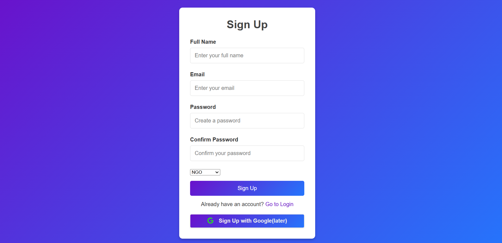
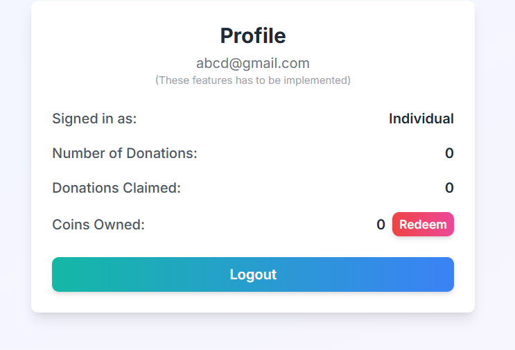
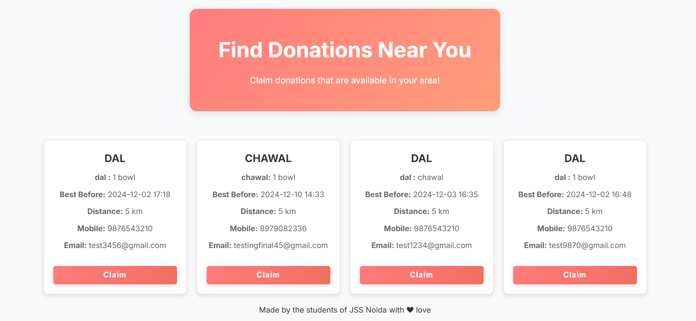
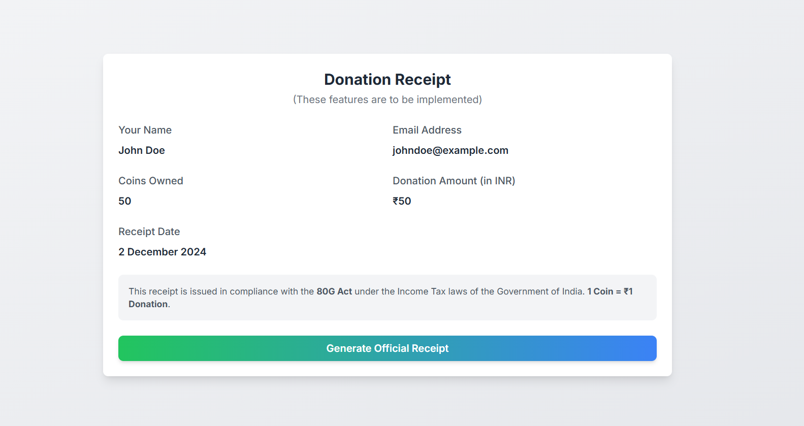
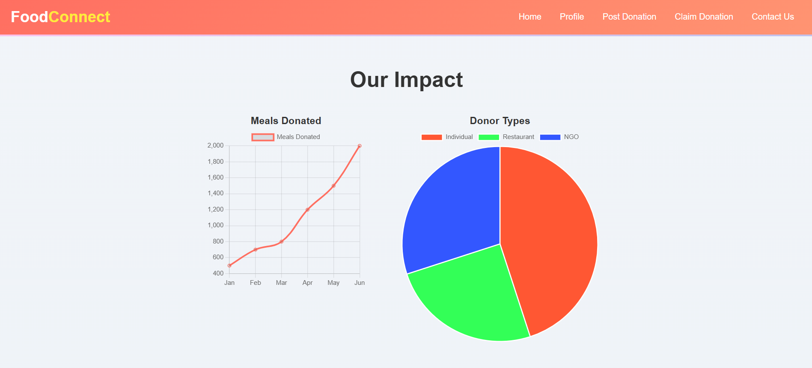

# 🥗 FOODCONNECT (Food Donation Platform)  

### **Reducing Food Wastage Through Technology**

Our platform is a tech-driven solution to connect individuals, NGOs, and restaurants for reducing food wastage. Wit# 🥗 **FOODCONNECT** - *Reducing Food Wastage Through Technology*

<div align="center">


</div>

---

### **🌟 Empowering Communities**  
FOODCONNECT is a platform that bridges the gap between excess food and those in need. Whether you're an individual, NGO, or restaurant, our tech-enabled platform helps reduce food wastage, one meal at a time.

---

## 🚀 **Features**

### 🔐 **Authentication**
- 🔑 Secure login and signup functionality using **Firebase Authentication**.
- 🧑‍🤝‍🧑 User types: **Individual Donors**, **NGOs**, and **Restaurants**.
- ✅ Password recovery and email verification are supported.



---

### 🏠 **Home Page**
- 📊 **Dynamic Charts**: Real-time donation statistics using **Chart.js**.
- 🎯 **Quick Navigation**: Buttons for Profile, Post Donation, Claim Donation, and Contact Us.
- ✨ **Sleek Design**: Gradient backgrounds and interactive UI elements.


---

### 🧑 **Profile Page**
- 👤 **User Information**: Displays email, user type, donations, and coins owned.
- 🪙 **Coins System**: Track rewards earned for donations.
- 🔓 **Logout**: Easy logout functionality.



---

### 🍱 **Post Donation Page**
- 📝 **Submit Food Donations**: Add details like food type, quantity, expiry date, and pickup location.
- 🔄 **Realtime Updates**: Track posted donations instantly.


---

### 🛒 **Claim Donation Page**
- 📥 **Claim Available Donations**: NGOs and individuals can claim donations instantly.
- 📡 **Real-Time Notifications**: Updates on claimed donations.
- 📜 **Tracking History**: Logs all claimed donations for transparency.



---

### 🧾 **Receipt Generator**
- 🏷️ **Generate Receipts**: Create donation receipts for **India’s 80G Tax Redemption**.
- 💾 **Downloadable PDF**: Easy access for tax benefits.



---

## 📊 **Graphs and Statistics**
- 📈 **Interactive Charts**: Track donation trends (line charts, pie charts).
- 📊 **Donor Breakdown**: Visualize donor types and donation stats.



---

## 💡 **How We Help**
1. **Donate Food**: Help reduce wastage by donating surplus food.  
2. **Earn Coins**: Get rewarded for donations with redeemable coins.  
3. **Tax Benefits**: Generate tax-saving receipts under **80G**.  
4. **Visualize Impact**: See your contributions through charts and stats.

---

## 🛠️ **Technologies Used**

<div align="center">

| **Technology**      | **Usage**                                      |
|----------------------|-----------------------------------------------|
|  | Structuring the website content.          |
|  | Designing and styling the platform.       |
|  | Adding interactivity and logic.           |
|  | Authentication & Realtime Database.       |
|  | Data visualization with interactive charts.|
|  | Responsive and modern design framework.    |

</div>

---

## 🔗 **Get Started**

### Clone the Repository
```bash
git clone https://github.com/your-repo-name.git
cd your-repo-name
h features like donation tracking, claiming donations, receipt generation, and a user-friendly interface, this platform creates a significant impact.

---

## 🚀 Features

### **Authentication**
- Secure login and signup functionality using **Firebase Authentication**.
- User types: **Individual Donors**, **NGOs**, and **Restaurants**.
- Password recovery and email verification are supported.


---

### **Home Page**
- **Dynamic Charts**: Showcases donation statistics (e.g., meals donated, donor types, etc.) using **Chart.js**.
- **Quick Navigation Buttons**:
  - `Profile`
  - `Post Donation`
  - `Claim Donation`
  - `Contact Us`
- **Aesthetic Design**: Gradient backgrounds, animations, and interactive UI.


---

### **Profile Page**
- Displays:
  - **User Information**: Email, user type, and donation statistics.
  - **Coins Owned**: Rewards for every donation (redeemable for tax benefits).
- Includes a logout button for quick sign-out.


---

### **Post Donation Page**
- **Post Food Donations**:
  - Fields: Food Type, Quantity, Expiry Date, Pickup Location.
  - Submit donation posts visible to NGOs and other entities.
- Real-time database updates via Firebase.


---

### **Claim Donation Page**
- Allows NGOs or needy individuals to claim donations.
- Real-time updates on food availability with instant claim notifications.
- Tracks claimed donations for future reference.


---

### **Receipt Generator**
- Generates a **donation receipt** for tax redemption purposes under **India's 80G Act**.
- Downloadable as PDF for user convenience.


---

## 📊 Graphs and Statistics
- Interactive **line charts** and **pie charts** to track:
  - Meals donated over time.
  - Donor types (e.g., Individuals, Restaurants, NGOs).
- Powered by **Chart.js** for a sleek, responsive design.


---

## 💡 How We Help?

1. **Food Donation**  
   Donors contribute surplus food items to help others.

2. **Earn Coins**  
   Reward system for donors—coins can be redeemed for benefits.

3. **Tax Benefits**  
   Receipts for 80G tax redemption provided upon donation claims.

4. **Impact Visualization**  
   Real-time tracking of donation statistics through charts and graphs.

---

## 🛠️ Technologies Used

### **Frontend**
- **HTML5**, **CSS3**, **JavaScript**: To create a polished and interactive user interface.
- **Tailwind CSS**: For responsive and modern design.

### **Backend**
- **Firebase Authentication**: Secure user login and signup.
- **Firebase Realtime Database**: Storing and managing donations and user data.

### **Data Visualization**
- **Chart.js**: For interactive graphs and donation statistics.

---
## 🚀 Technologies Used

<div align="center">


</div>


## 🔗 Get Started

### Clone the Repository
```bash
git clone https://github.com/your-repo-name.git
cd your-repo-name
