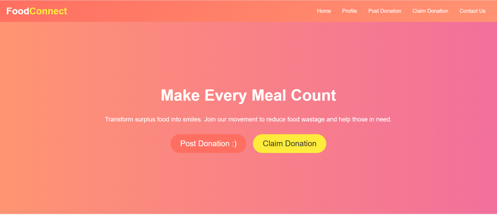

This is a repository for Food-wastage-reduction-tracker webapp
## (harsht) frontend of login page is created by harshit on 19 nov 2024 at 9:33
## (harshit) signup frontend is created by harshit on 20 nov at 6:33
## created side bar for main home page by anuj on 21 nov at 7:50
## created post button by anuj on 30 nov 11:55 
## (harshit) created frontend for post page and figured out database structure for claim/donate operations on 30 nov at 1:28 am 
## added redirect feature to the post button { by anuj} 1 dec 4:25 pm
## (harshit)backend of post donation page has been done by harshit on 1 dec 9:15 pm
## (harshit)whole backend and frontend of claim donation page is created by harshit till 2 am 2 dec 2024
## (harshit) backend of login page is fully created by harshit at 2:27 am 2 dec
## (harshit) pages are linked by harshit on 2:35
## (harshit) profile section is created by harshit on 3:52 am
## (harshit) different pages are created and linked by harshit on 3:52
##  (harshit) new homepage designed by harshit
## (harshit) (styling of ui is done by harshit)
## (harshit ) current user state handling is done by harshit
##  (harshit) coin system designed by harshit

# 🥗 Food Donation Platform  

### **Reducing Food Wastage Through Technology**

Our platform is a tech-driven solution to connect individuals, NGOs, and restaurants for reducing food wastage. With features like donation tracking, claiming donations, receipt generation, and a user-friendly interface, this platform creates a significant impact.

---

## 🚀 Features

### **Authentication**
- Secure login and signup functionality using **Firebase Authentication**.
- User types: **Individual Donors**, **NGOs**, and **Restaurants**.
- Password recovery and email verification are supported.



---

### **Home Page**
- **Dynamic Charts**: Showcases donation statistics (e.g., meals donated, donor types, etc.) using **Chart.js**.
- **Quick Navigation Buttons**:
  - `Profile`
  - `Post Donation`
  - `Claim Donation`
  - `Contact Us`
- **Aesthetic Design**: Gradient backgrounds, animations, and interactive UI.


---

### **Profile Page**
- Displays:
  - **User Information**: Email, user type, and donation statistics.
  - **Coins Owned**: Rewards for every donation (redeemable for tax benefits).
- Includes a logout button for quick sign-out.


---

### **Post Donation Page**
- **Post Food Donations**:
  - Fields: Food Type, Quantity, Expiry Date, Pickup Location.
  - Submit donation posts visible to NGOs and other entities.
- Real-time database updates via Firebase.


---

### **Claim Donation Page**
- Allows NGOs or needy individuals to claim donations.
- Real-time updates on food availability with instant claim notifications.
- Tracks claimed donations for future reference.


---

### **Receipt Generator**
- Generates a **donation receipt** for tax redemption purposes under **India's 80G Act**.
- Downloadable as PDF for user convenience.


---

## 📊 Graphs and Statistics
- Interactive **line charts** and **pie charts** to track:
  - Meals donated over time.
  - Donor types (e.g., Individuals, Restaurants, NGOs).
- Powered by **Chart.js** for a sleek, responsive design.


---

## 💡 How We Help?

1. **Food Donation**  
   Donors contribute surplus food items to help others.

2. **Earn Coins**  
   Reward system for donors—coins can be redeemed for benefits.

3. **Tax Benefits**  
   Receipts for 80G tax redemption provided upon donation claims.

4. **Impact Visualization**  
   Real-time tracking of donation statistics through charts and graphs.

---

## 🛠️ Technologies Used

### **Frontend**
- **HTML5**, **CSS3**, **JavaScript**: To create a polished and interactive user interface.
- **Tailwind CSS**: For responsive and modern design.

### **Backend**
- **Firebase Authentication**: Secure user login and signup.
- **Firebase Realtime Database**: Storing and managing donations and user data.

### **Data Visualization**
- **Chart.js**: For interactive graphs and donation statistics.

---

## 🖼️ Screenshots

### **Authentication Page**


### **Home Page**


### **Profile Page**


### **Post Donation Page**


### **Claim Donation Page**


### **Receipt Generator**


---

## 🔗 Get Started

### Clone the Repository
```bash
git clone https://github.com/your-repo-name.git
cd your-repo-name
